<h1>CARscan-Internship<h1>
  
<h5>For the task assigned, I used the PixelLib library. Deeplabv3+ model trained on pascalvoc dataset is used. This model supports 20 common object categories like person, bus, car, aeroplane, train, tv etc. which means the background of these objects can be changed as per our desire.</h5>

<h2>Given Images <h2>
  
 
 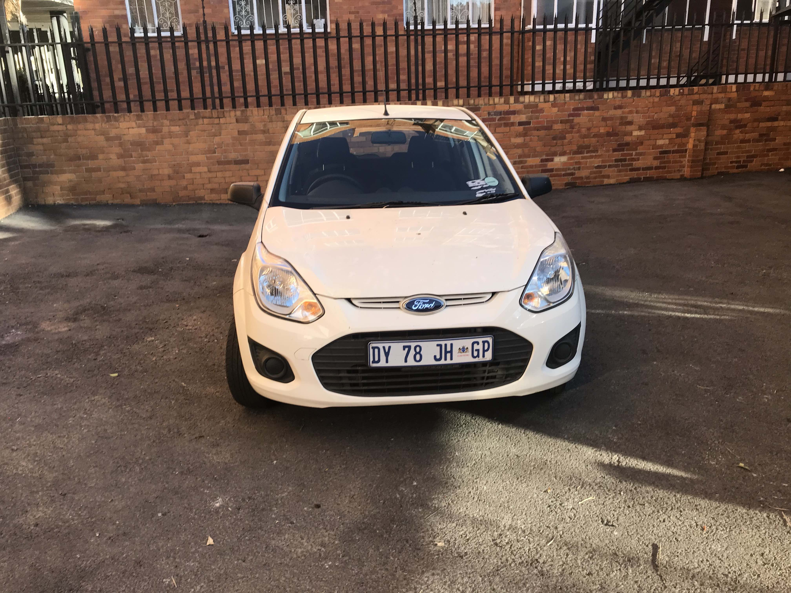
 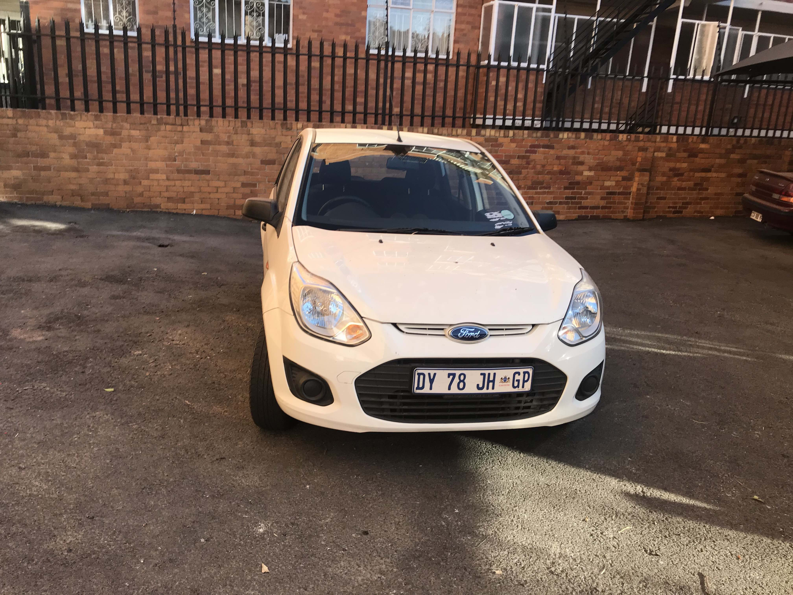
  
<h2> 1. Output after background removal <h2>
  
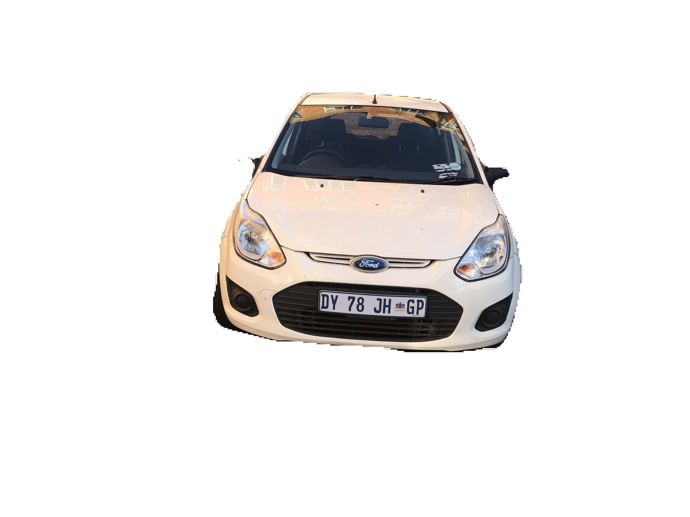
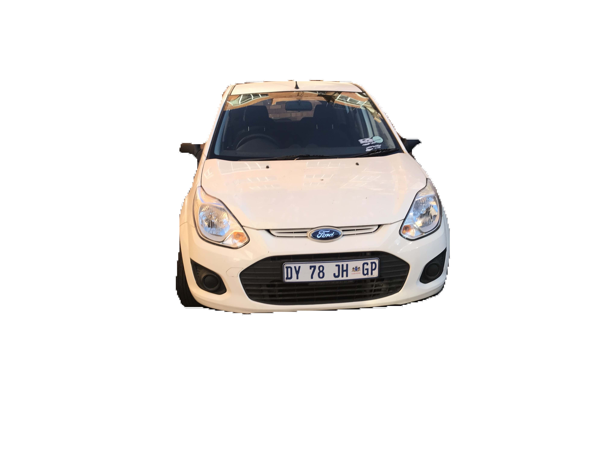
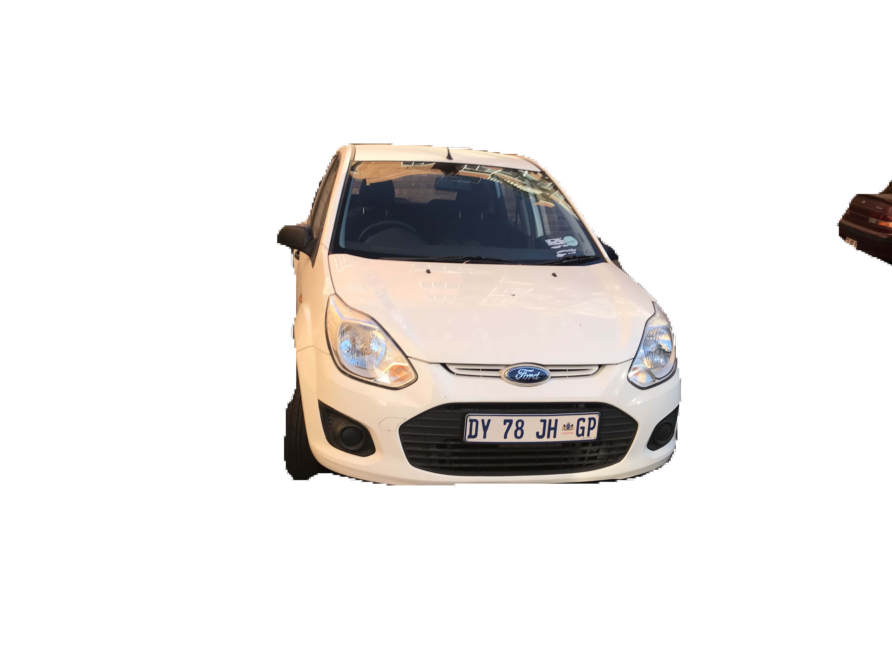
  
<h2> 2. Output after changing the background with another image. <h2>
  
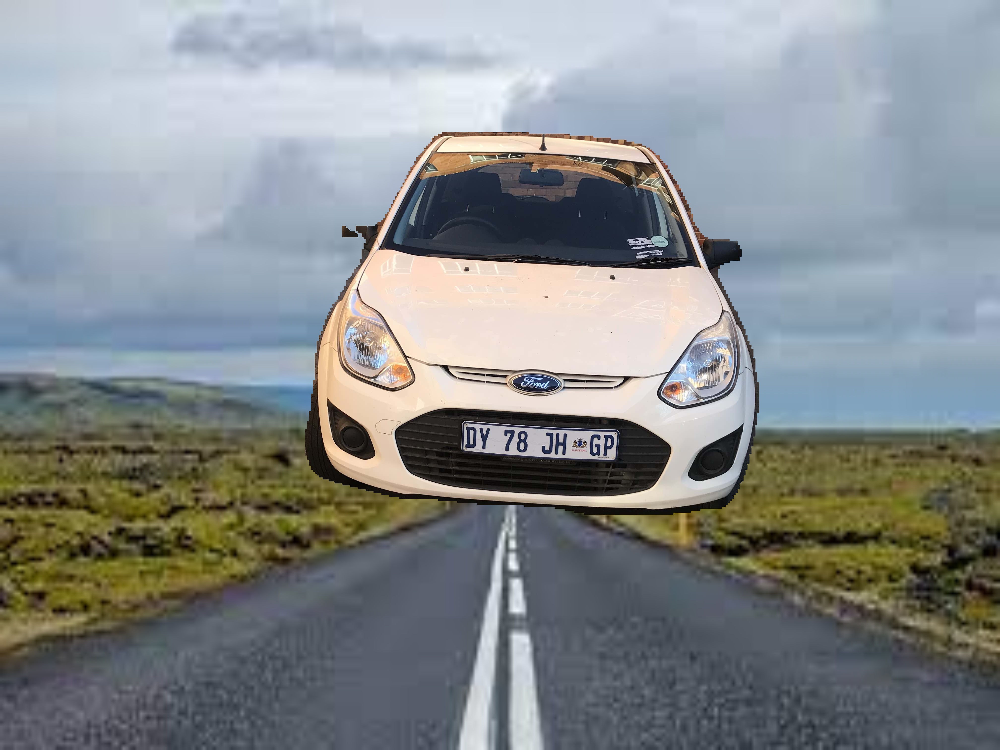
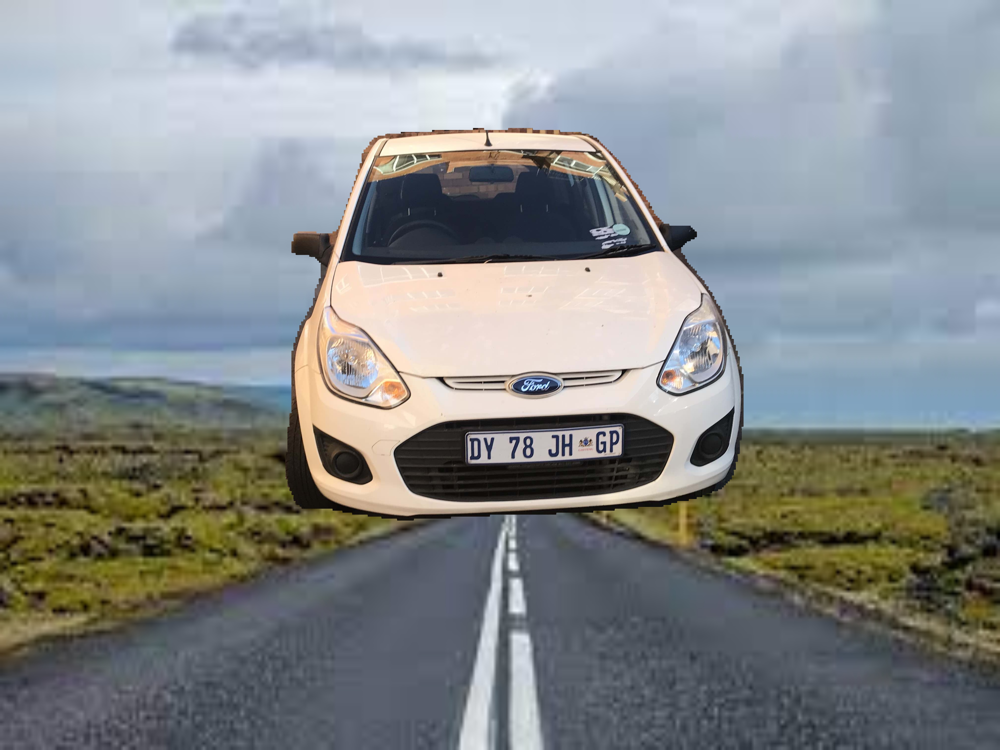
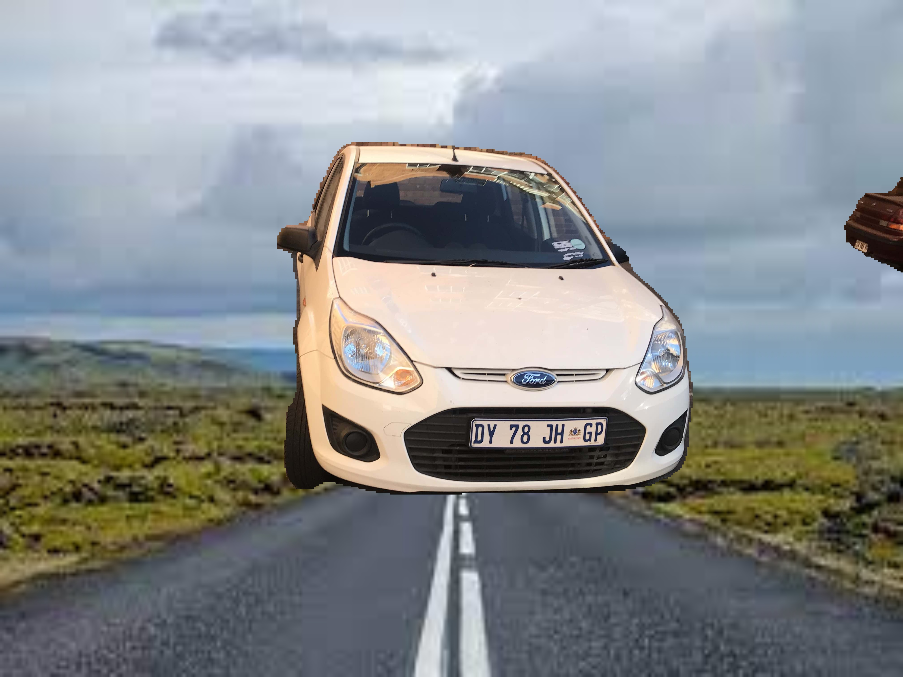
  
 <h2> 3. Output after changing the original background to grayscale <h2>
   
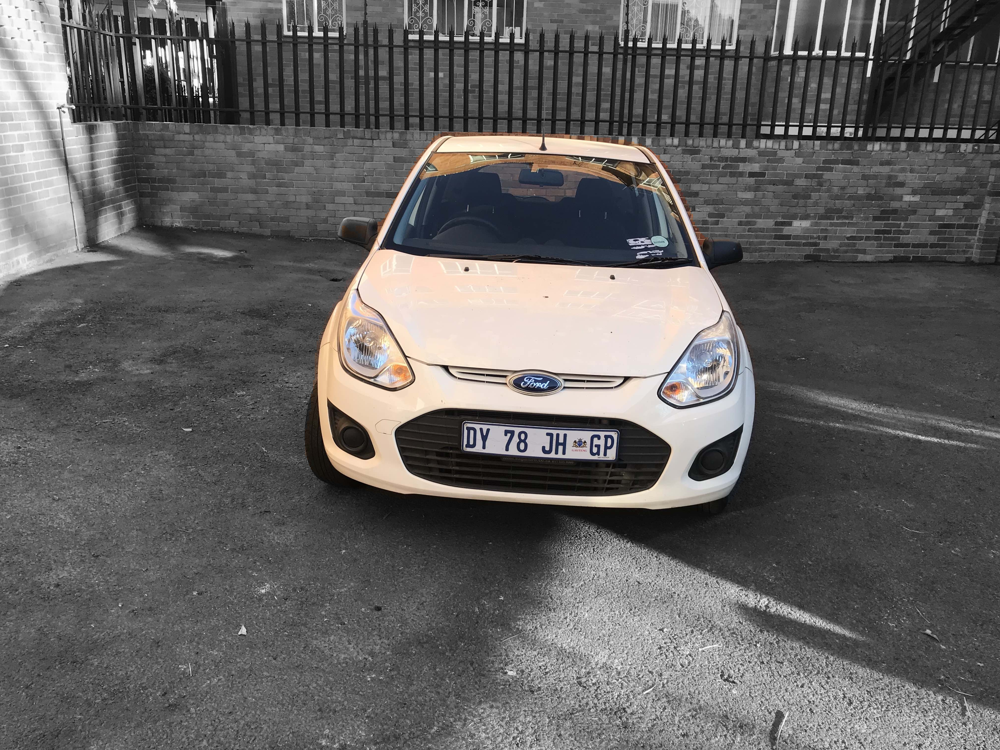
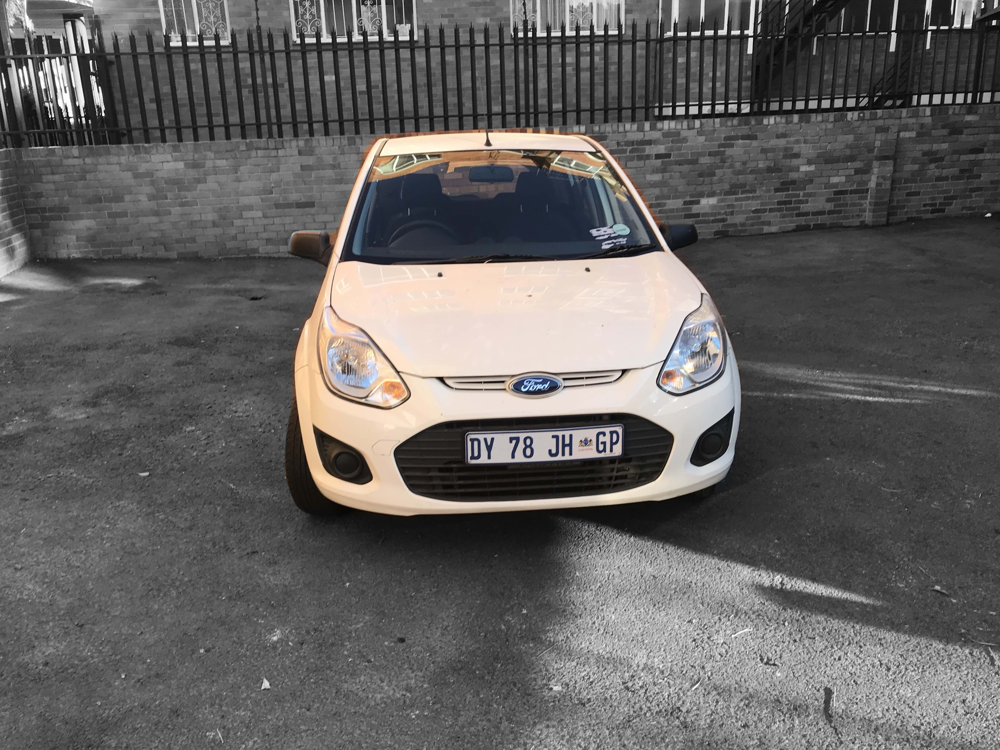
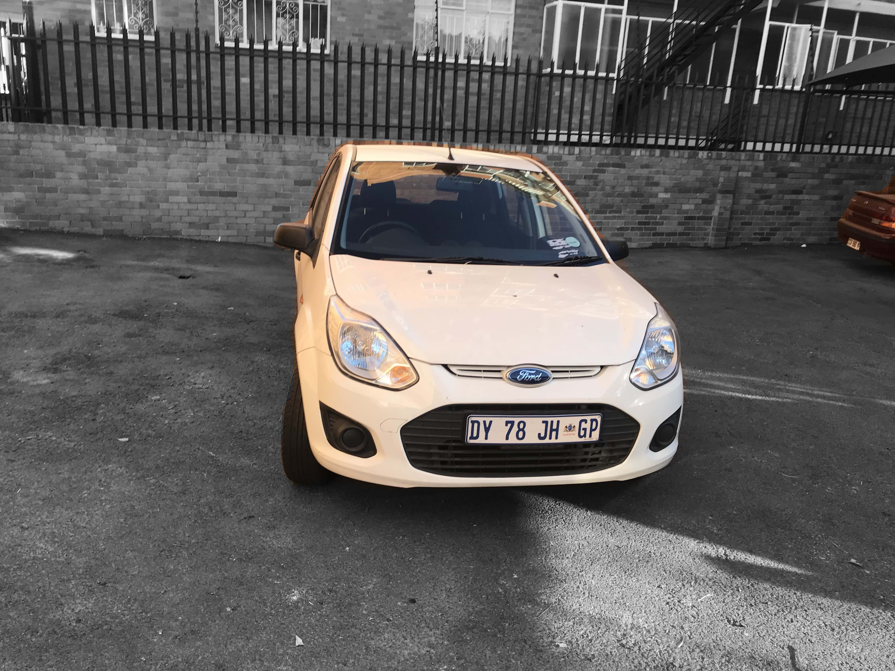

  
