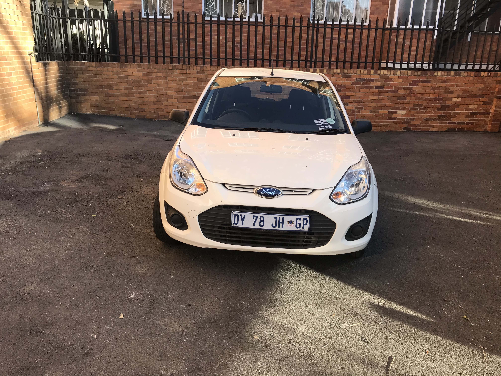

<h1>CARscan-Internship<h1>

<h2>Given Images <h2>
  

  

  

  
<h2> 1. Output after background removal <h2>
  

  

  

  
  
<h2> 2. Output after changing the background with another image. <h2>
  

  

  

  
 <h2> 3. Output after changing the original background to grayscale <h2>
   

  

  

  
